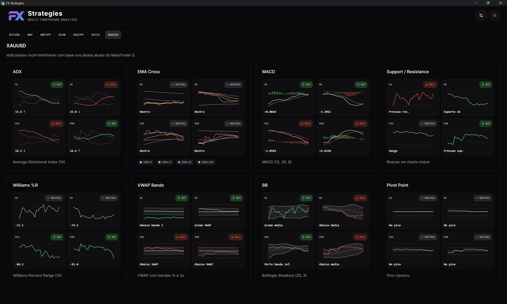
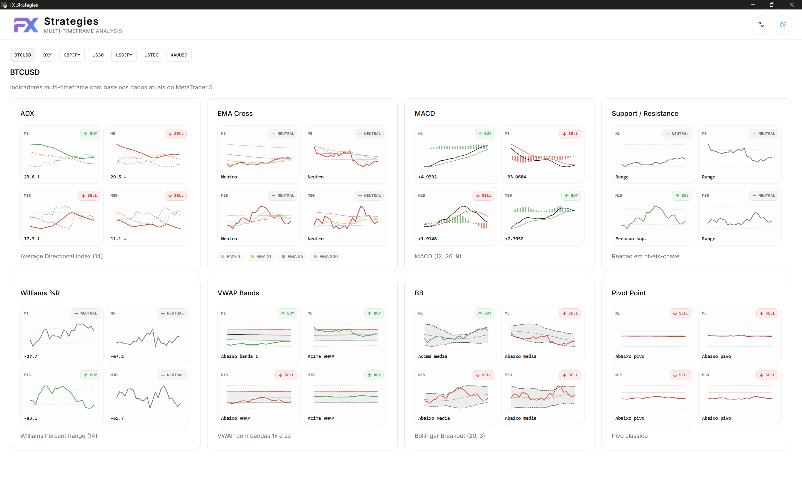
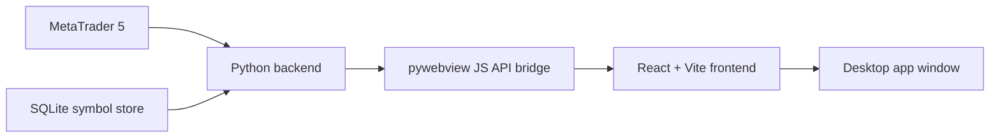

# FX Strategies

<p align="center">
  <strong>Desktop multi-timeframe trading dashboard powered by MetaTrader 5, pywebview, React, and Python.</strong>
</p>

<p align="center">
  <a href="#english">English</a> •
  <a href="#portugues">Português</a> •
  <a href="#日本語">日本語</a>
</p>

<p align="center">
  
  
  
  
  
  
</p>

## Overview

FX Strategies is a Windows-focused desktop application for monitoring multiple trading symbols through a compact multi-timeframe indicator dashboard. It combines a Python backend, a React frontend, and MetaTrader 5 market data inside a native desktop window built with `pywebview`.

The application stores the selected symbols locally, fetches rates from MetaTrader 5, calculates technical indicators in Python, and renders a modern card-based interface with light and dark themes.

## Screenshots

<table>
  <tr>
    <td width="50%">
      
    </td>
    <td width="50%">
      
    </td>
  </tr>
  <tr>
    <td align="center"><strong>Dark Theme</strong></td>
    <td align="center"><strong>Light Theme</strong></td>
  </tr>
</table>

## Highlights

- Desktop-first experience with `pywebview`
- Real MetaTrader 5 integration for symbols and candle data
- Multi-timeframe analysis across `M1`, `M5`, `M15`, and `M30`
- Local symbol persistence with SQLite in `%APPDATA%/FX Strategies`
- Indicator cards with mini charts, signal badges, and per-timeframe summaries
- Support for light and dark themes
- Development runner that starts Vite and hot-reloads the Python app
- Windows-friendly packaging with PyInstaller

## Included Indicators

- ADX
- EMA Cross (`EMA 9`, `EMA 21`, `EMA 55`, `EMA 200`)
- MACD (`12, 26, 9`)
- Support / Resistance
- Williams %R
- VWAP Bands
- Bollinger Breakout
- Pivot Point

## Tech Stack

| Layer | Tools |
| --- | --- |
| Desktop shell | `pywebview` |
| Backend | `Python 3.12`, `SQLAlchemy`, `pandas`, `MetaTrader5` |
| Frontend | `React 19`, `TypeScript`, `Vite`, `Tailwind CSS`, `TanStack Query` |
| Storage | `SQLite` |
| Packaging | `PyInstaller` |

## Architecture



## Quick Start

### Requirements

- Windows environment
- Python `3.12+`
- Node.js
- `pnpm` enabled through Corepack or installed globally
- MetaTrader 5 installed and available on the same machine

### 1. Install dependencies

```powershell
uv sync
cd frontend
pnpm install
cd ..
```

### 2. Start in development mode

```powershell
uv run python -m src.scripts.dev
```

This starts:

- the Vite development server
- the Python desktop app in development mode
- automatic Python restart when files inside `src/` change

### 3. Build the desktop app

```powershell
uv run python -m src.scripts.build
```

To generate an `onedir` build instead of the default `onefile` build:

```powershell
uv run python -m src.scripts.build --onedir
```

## Configuration

### Frontend and window settings

| Variable | Purpose |
| --- | --- |
| `FX_STRATEGIES_MODE` | `dev` or `prod` |
| `FX_STRATEGIES_DEV_URL` | Vite URL in development |
| `FX_STRATEGIES_VITE_PORT` | Vite port override |
| `FX_STRATEGIES_DIST_INDEX` | Custom built frontend entry file |
| `FX_STRATEGIES_WINDOW_TITLE` | Desktop window title |
| `FX_STRATEGIES_WINDOW_WIDTH` | Window width |
| `FX_STRATEGIES_WINDOW_HEIGHT` | Window height |
| `FX_STRATEGIES_WINDOW_MIN_WIDTH` | Minimum width |
| `FX_STRATEGIES_WINDOW_MIN_HEIGHT` | Minimum height |

### MetaTrader 5 connection settings

| Variable | Purpose |
| --- | --- |
| `FX_STRATEGIES_MT5_PATH` | MetaTrader 5 terminal path |
| `FX_STRATEGIES_MT5_LOGIN` | Account login |
| `FX_STRATEGIES_MT5_PASSWORD` | Account password |
| `FX_STRATEGIES_MT5_SERVER` | Broker server name |

## Project Structure

```text
fx_strategies/
├─ src/
│  ├─ MQL/           # MetaTrader 5 integration and connection management
│  ├─ controllers/   # Application-level orchestration
│  ├─ database/      # SQLite session and initialization
│  ├─ models/        # SQLAlchemy models
│  ├─ services/      # pywebview API bridge
│  ├─ scripts/       # Development and build runners
│  └─ use_cases/     # Indicator calculations and dashboard payload assembly
├─ frontend/
│  ├─ src/components/
│  ├─ src/hooks/
│  ├─ src/layout/
│  └─ src/types/
└─ screenshot/
   ├─ dark.png
   └─ light.png
```

## Commit Convention

This repository follows a Conventional Commits style for commit messages.

Examples:

- `feat(api): add structured MT5 error responses`
- `fix(ui): prevent pywebview callback crash`
- `docs(readme): add multilingual project overview`
- `ci(release): build Windows binary on version tags`

See [CONTRIBUTING.md](./CONTRIBUTING.md) for the full convention and local template setup.

---

## English

### What this project does

FX Strategies is a desktop dashboard for traders who want to inspect several symbols through a single, dense, multi-timeframe workspace. The app loads saved symbols, fetches price data from MetaTrader 5, calculates indicators in Python, and renders the results in an interface optimized for fast scanning.

### Main capabilities

- Track multiple instruments from one desktop app
- Review indicator snapshots across four short-term timeframes
- Switch between light and dark UI themes
- Save symbol metadata locally for quick reuse
- Package the app as a standalone Windows executable

### Recommended use case

This project fits traders and developers who want a local desktop tool instead of a browser-only dashboard, especially when the workflow depends on MetaTrader 5 data and custom Python indicator logic.

---

## Portugues

### O que este projeto faz

FX Strategies é um dashboard desktop para traders que querem analisar vários símbolos em um único espaço de trabalho multi-timeframe. O app carrega os símbolos salvos, busca os dados no MetaTrader 5, calcula os indicadores em Python e mostra tudo em uma interface pensada para leitura rápida.

### Capacidades principais

- Acompanhar vários ativos dentro de um único aplicativo desktop
- Ver snapshots de indicadores em quatro timeframes curtos
- Alternar entre tema claro e escuro
- Salvar símbolos localmente para reutilização rápida
- Empacotar a aplicação como executável Windows

### Caso de uso recomendado

Este projeto é uma boa base para traders e desenvolvedores que preferem uma ferramenta local, em vez de um dashboard apenas no navegador, principalmente quando o fluxo depende de dados do MetaTrader 5 e de lógica de indicadores em Python.

---

## 日本語

### このプロジェクトについて

FX Strategies は、複数の銘柄を 1 つのデスクトップ画面で素早く確認するためのマルチタイムフレーム分析アプリです。保存済みシンボルを読み込み、MetaTrader 5 から価格データを取得し、Python でインジケーターを計算して、見やすいカード UI に表示します。

### 主な機能

- 複数銘柄を 1 つのデスクトップアプリで監視
- `M1`、`M5`、`M15`、`M30` の 4 つの時間足を同時に確認
- ライトテーマとダークテーマの切り替え
- シンボル情報をローカルに保存
- Windows 向けに単体実行形式へパッケージ可能

### 想定される利用シーン

ブラウザ中心ではなく、MetaTrader 5 と Python ベースの分析ロジックを組み合わせたローカル環境のトレーディングツールを作りたい場合に適しています。
